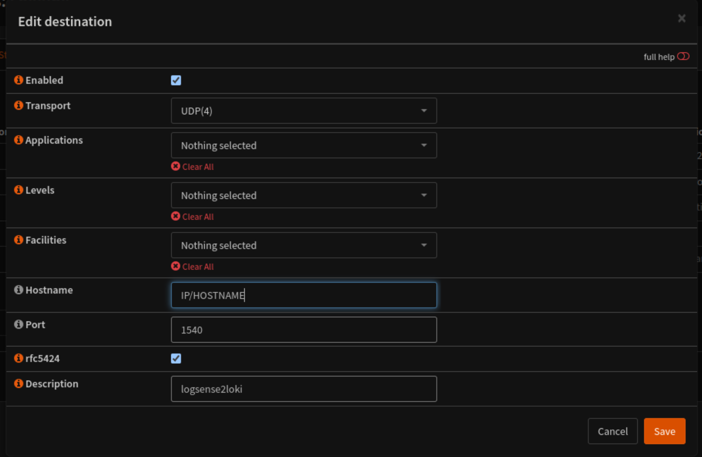
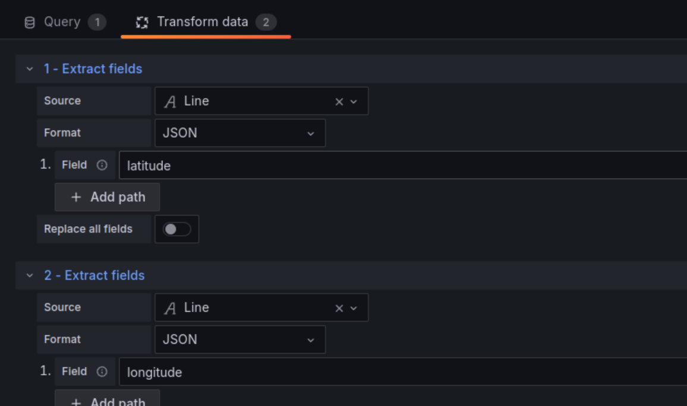
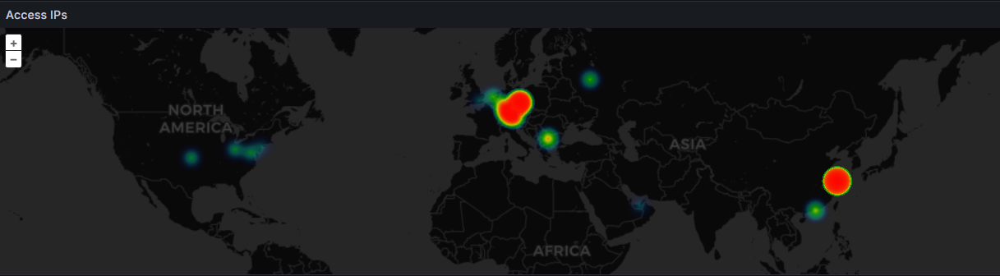

# LogSense2Loki

**LogSense2Loki** is a sophisticated Python-based solution designed for modern logging infrastructures. It captures syslog messages, intelligently parses them into JSON format, and efficiently forwards them to Grafana Loki. With optional GeoIP lookup capabilities, LogSense2Loki enhances your logs with geolocation data, providing invaluable insights for monitoring and analysis. Additionally, it exposes Prometheus metrics to ensure you can effortlessly track the performance of your logging setup.

just kidding,

it's probably not very performant, but it does what it's supposed to as long as OPNsense itself doesn't log json, it's definitely the best way.

With JSON it is very easy to search and analyze the logs, and especially to visualize them with Loki in Grafana.

It is quite simple so that you can easily add additional parsers, metrics endpoint gives information about how many percent could be parsed, for me it is 99.99%

## Features

- **Syslog Capture and Parsing**: Seamlessly capture syslog messages and parse them into a structured JSON format.
  - actualy integrated parser:
    * configd
    * cron
    * devd
    * dhcp
    * filterlog
    * lighttpd
    * resolver (unbound)
    * syslog-ng
    * audit (wip)
    * kernel (wip)
    * dpinger (wip)
    * opnsense (wip)


- **Loki Integration**: Effortlessly forward parsed logs to Grafana Loki for advanced log querying and visualization.
- **GeoIP Lookup**: Optional GeoIP lookup for public IP addresses, enhancing logs with city and country information (the geoip database can be easily integrated via maxmind.com).
- **Prometheus Metrics**: Exposes crucial Prometheus metrics to track successful and failed log parsing and transmission activities.

## Prometheus Metrics

LogSense2Loki provides the following Prometheus metrics endpoint at `http://localhost:8100/metrics`:

- `logsense2loki_successful_logs_total`: Monitors the total number of successfully parsed and sent logs.
- `logsense2loki_failed_logs_total`: Tracks the total number of logs that failed to parse or send.


## example Filterlogs

from:

`201,,,0a40f86c186bf24db3d173b50ef28a54,vtnet2_vlan99,match,pass,in,4,0x0,,64,35287,0,DF,17,udp,69,10.0.99.244,10.0.99.1,49,53,70`

to:

```json
{
  "timestamp": "2024-05-28T16:39:59+02:00",
  "hostname": "firewall",
  "service": "filterlog",
  "rulenumber": "201",
  "uuid": "0a40f86c186bf24db3d173b50ef28a54",
  "interface": "vtnet2_vlan99",
  "reason": "match",
  "action": "pass",
  "direction": "in",
  "ipversion": "4",
  "tclass": "0x0",
  "ttl": "64",
  "ident": "35287",
  "flags": "DF",
  "proto_num": "17",
  "proto": "udp",
  "protolength": "69",
  "src_ip": "10.0.99.244",
  "dst_ip": "10.0.99.1",
  "length": "49",
  "src_port": "45730",
  "dst_port": "53"
}

```


## Configuration


## OPNsense configuration

System -> Settings -> Logging -> Remote -> "+"




### Environment Variables

Configure LogSense2Loki using the following environment variables:

- `SYSLOG_HOST`: The syslog server host (default: `0.0.0.0`)
- `SYSLOG_PORT`: The syslog server port (default: `1540`)
- `LOKI_URL`: The Grafana Loki URL (default: `https://logs.domain.com/api/prom/push`)
- `GEOIP_DB_PATH`: Path to the MaxMind GeoIP database (default: `/geo/db/GeoLite2-City.mmdb`)
- `ENABLE_GEOIP`: Enable (`True`) or disable (`False`) GeoIP lookups (default: `False`)
- `THREAD_MULTIPLIER` : Multiplikator of the Worker-Threads (default: `4`)
- `QUEUE_SIZE` : Queue Size (default: `10000`)
- `QUEUE_THREAD_MULTIPLIER` : Multiplikator of the  Queue Threads (default: `4`)
- `JOB_LABEL` : loki job label (default: `opnsense-parser-test`)
- `LOG_BATCH_SIZE` : to sending batch size (default: `100`)

### Sample Configuration File (`config.py`)

```python
SYSLOG_HOST = '0.0.0.0'
SYSLOG_PORT = 1540
LOKI_URL = 'https://logs.domain.com/api/prom/push'
GEOIP_DB_PATH = "/geo/db/GeoLite2-City.mmdb"
ENABLE_GEOIP = False
THREAD_MULTIPLIER = 2  
QUEUE_SIZE = 10000  
QUEUE_THREAD_MULTIPLIER = 4
JOB_LABEL="opnsense-parser-test"
LOG_BATCH_SIZE=100
```

## Running LogSense2Loki with Docker

### Docker Compose Configuration

Here is a sample `docker-compose.yml` to get you started:

```yaml
version: "2"
services:
  LogSense2Loki:
    image: badsmoke/logsense2loki
    ports:
      - 1540:1540
      - 8100:8100
    restart: always
    volumes:
      - ./geodb/:/geodb/
    environment:
      - SYSLOG_HOST=0.0.0.0
      - SYSLOG_PORT=1540
      - LOKI_URL=https://logs.domain.com/api/prom/push
      - GEOIP_DB_PATH=/geo/db/GeoLite2-City.mmdb
      - ENABLE_GEOIP=False
      - JOB_LABEL="opnsense-parser-test"
  geoip:
        image: maxmindinc/geoipupdate:v4.10
        restart: unless-stopped
        environment:
          - GEOIPUPDATE_ACCOUNT_ID=
          - GEOIPUPDATE_LICENSE_KEY=
          - GEOIPUPDATE_EDITION_IDS=GeoLite2-City
          - GEOIPUPDATE_FREQUENCY=168
        volumes:
          - ./geodb:/usr/share/GeoIP      
```

To run LogSense2Loki with the above configuration, use:

```bash
docker-compose up -d
```

### Building the Docker Image

Build the Docker image with the following command:

```bash
docker build -t logsense2loki .
```

## Grafana Geomap Integration

To visualize the GeoIP data in Grafana Geomap, follow these steps:

1. **Configure Data Source**: Ensure your Loki data source is configured in Grafana.
2. **Create a New Dashboard**: Add a new panel using the Geomap plugin.
3. **Data Query**: Use a query that extracts the relevant GeoIP information. Example query:

   ```logql
   {service="geoip"} |= "latitude" |= "longitude" 
   ```

   

   


4. **Styling and Visualization**: Customize the appearance of your Geomap panel to suit your needs.


## Conclusion

**LogSense2Loki** brings structure, insight, and performance to your logging infrastructure. With its powerful parsing, forwarding, GeoIP, and metric capabilities, it's an indispensable tool for any modern monitoring ecosystem.


## todo's

* ~~add geoip?~~
* check filterlog block/pass in/out 
* add parser
* add other endpoints
* ~~add geoip database site container "maxmindinc/geoipupdate:v4.10"~~
* with some logs the end of the line is not recognized, so there are problems with parsing


## Recommended Project

In addition to my project, I would like to recommend the project [opnsense-exporter](https://github.com/AthennaMind/opnsense-exporter) – it complements my project well and offers many useful features!


## License

This project is licensed under the MIT License.


